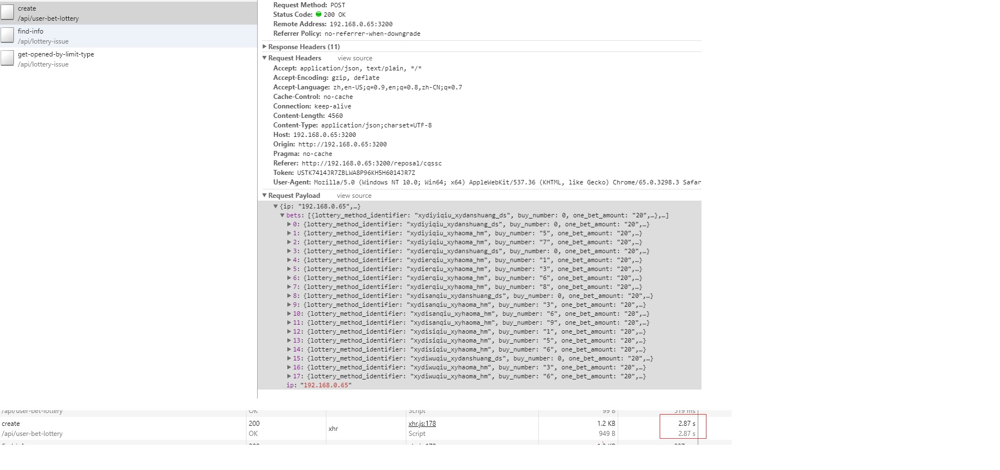
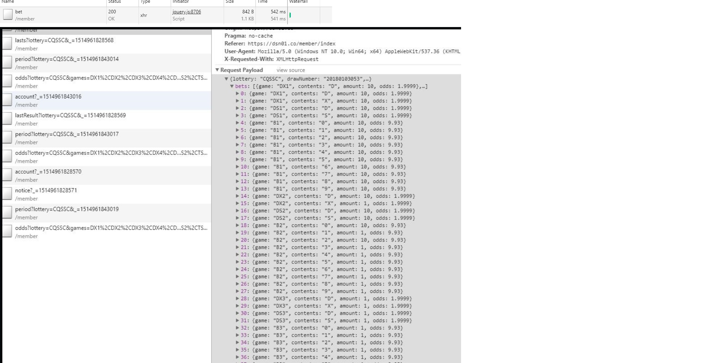
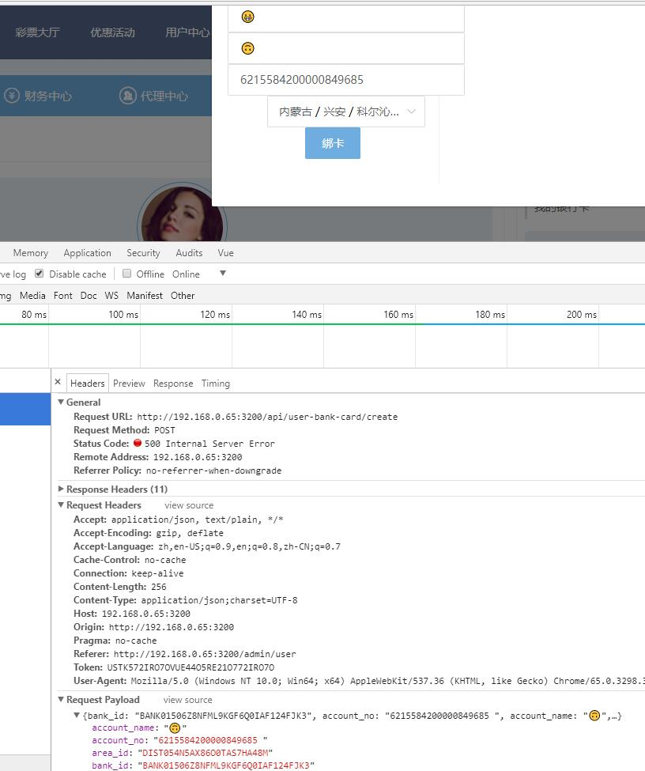

- [用户信息-发消息](#yong-hu-xin-xi-fa-xiao-xi)
- [信用投注](#xin-yong-tou-zhu)
- [添加银行卡](#tian-jia-yin-xing-qia)
- [多彩种投注](#duo-cai-chong-tou-zhu)
- [游戏记录](#you-xi-ji-lu)
- [在线会员](#duo-cai-chong-tou-zhu)
- [广告](#guang-gao)

## <nuxt-link to="/admin/message">用户信息-发消息</nuxt-link>

`/api/user-message/send-message`

- 前端交互上已实现下级列表全选，最好添加一个字段支持群发，减小请求传输内容体积

- 发消息成功后需要返回新消息的uuid,用来实现无刷新（不再请求`/api/user-message/get` ）更新发件箱

- 测试收发件箱 用户类型 都为普通用户，`type=1`

## 信用投注

`/api/user-bet-lottery/create`

> 测试选号10几注，等待时间会很长,[迪斯尼彩票](https://dsn01.co){target=_blank} 试玩正常

-- 等待合并方案

## 添加银行卡

`/api/user-bank-card/create`

> 测试 提交数据包含emoji时会报500错误，之后再账号再发起 `/api/user-bank-card/get` 都会报500错误

## 多彩种投注 ⁉

`/api/user-bet-lottery/create`

> 多彩种一起投注时,只有最先添加的彩种可以投注成功，其他彩种提示‘资料更新失败’

> 像快3这种开奖时间1小时+的有用

-- 综合投注页面，乐天堂参考

## 游戏记录

`/api/user-bet-lottery/get`

> 在报表记录-游戏记录 里 传输参数不添加type时，返回的drop_list.keyword_type_list 应该无 "依用户名"

-- 后端处理

## 在线会员

`/api/user/get-children`

测试加载时间过长,1.8s

-- node中间层建立socket

## 广告

`/api/advertisement/get`

> img_path 图片url不可访问

